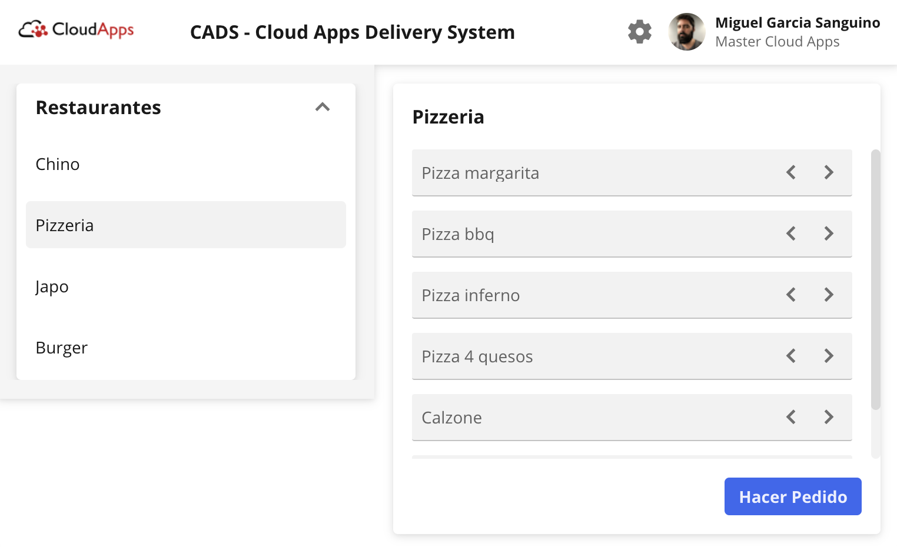

# Orchestrated-Saga-with-Events-and-Consumers



Este proyecto es el Trabajo de Fin de Master de [@MasterCloudApps](https://twitter.com/MasterCloudApps/).

📓 [Memoria](./docs/Memoria.pdf)


📽️ [Presentación](./docs/PRESENTACION.pdf)

Se ha creado una transacción con micro servicios completa, punto a punto para un ficticio sistema de envío de comida a domicilio. El proyecto consta de:

* Micro servicios desplegados en kubernetes usando kafka para comunicarse
* Frontend y un servicio BFF (Backend for frontend) para enlazar con el front
* Servicios externos mockeados

La idea es que todos los elementos sea resilientes, escalables e independientes. Evitando al máximo el acoplamiento.

La saga se ha aplicado utilizando coreografía con kafka para la communication entre los servicios.

El BFF recoge los eventos del middleware e informa al usuario, ya sea online usando web sockets / server sent events, o bien offline usando el servicio de notificaciones (mock).

Para más información sobre el proyecto ver [la memoria](./docs/Memoria.pdf) o [la presentación](./docs/PRESENTACION.pdf)

## Servicios

Los servicios están desarrollados con node. Todos tienen una dependencia common que hace de base de los servicios para conectar a kafka y mongo, [`@sanguino/tfm-base-service`](https://github.com/sanguino/TFM/packages/1276489). 

### tfm-base-service
Se ha abstraído las conexiones a kafka y mongo a esta dependencia para no repetir código. Además, se exponen funciones para crear productores y consumidores estándares.
Kafka esta configurado para no hacer autocommit. En el caso de los consumidores se pasa el topic y la función que lo consume. La función que lo consume debe devolver una promesa. 
Esta promesa una vez resuelta se calcula si sé debe cambiar el offset del topic.

De esta manera los servicios se abstraen de toda la logica de kafka y solo se preocupan de su lógica de negocio.

## Construir los servicios

Para poder instalar la dependecia de `@sanguino/tfm-base-service` se debe tener en el .npmrc

```properties
//npm.pkg.github.com/:_authToken=${ACCESS_TOKEN}
@sanguino:registry=https://npm.pkg.github.com/sanguino
```
> es necesario que se añada el accesstoken para acceder a este registry

Todos los servicios utilizan docker multistage para construirse, y están pensados para configurarse e instalar dependencias lo primero y por último copiar el src. Esto ayuda mucho al proceso de desarrollo para evitar tener que instalar las dependencias cada vez que editamos el src.

Para instalar las dependencias se copia el `.npmrc` dentro de stage de build, se instalan las dependencias y se borra el `.npmrc`. Al usarse y eliminarse en el stage de build evitamos que nuestras credenciales queden en algunas de las capas de docker.

```Dockerfile
FROM node:16.14.2-alpine3.15 AS builder
...
COPY package*.json /usr/src/app/
COPY .npmrc /usr/src/app/
RUN npm ci --only=production
RUN rm -rf .npmrc
...

FROM node:16.14.2-alpine3.15
WORKDIR /usr/src/app
COPY --from=builder /usr/src/app/ /usr/src/app/
...
```

De esta manera, al copiar el código y las dependencias stage final, evitamos que acaben nuestras credenciales en la imagen de docker.

### Construir el frontend

Para construir el frontend se utiliza rollup. Los estáticos del frontend se despliegan junto al BFF. 

Se usa la misma estrategia que con el resto de servicios, pero se lanza la build de rollup en el stage de build y se copian los assets generados en la imagen final.

```Dockerfile
FROM node:16.14.2-alpine3.15  AS builder
...
WORKDIR /usr/src/web
RUN npm ci
RUN rm -rf .npmrc
RUN npm run build

FROM node:16.14.2-alpine3.15
...
COPY --from=builder /usr/src/web/public /usr/src/app/public
...
```

### web sockets / server sent events

Se puede cambiar de web sockets a server sent events cambiando la propiedad `FRONT_CONNECTION_TYPE` en el fichero [.env](./front/.env), poniendo el valor `WS` o `SSE` y haciendo docker build de nuevo 

#### Scripts

Se han creado 3 scripts para facilitar la construcción y despliegue / push de las imágenes:  [`buildAllDockerImages.sh`](./buildAllDockerImages.sh), [`buildAndDeploy.sh`](./buildAndDeploy.sh) y [`buildAndPush.sh`](./buildAndPush.sh)

## Arrancar con docker-compose

Se recomienda su uso en kubernetes, pero si es necesario se puede usar el ficher [docker-compose.yaml](./docker-compose.yaml)
```bash
$ docker-compose up -d
```

## Arrancar en kubernetes

La forma más sencilla es usar minikube, se debe arrancar con el addon de ingress:

```bash
$ minikube start --addons ingress
```

Obtenemos la ip de minikube:
```bash
$ minikube ip
```

Y la utilizamos para crear las dns que el ingress tiene configuradas (debe ser añadida al `/etc/hosts`)
```properties
192.168.64.6 cads.k8stfm.com
```
El ingress tambien expone [`kowl`](https://github.com/redpanda-data/kowl) y [`kafka-ui`](https://github.com/provectus/kafka-ui) para facilitar la depuraración de eventos. Si se desean usar se deben añadir también las dns:
```properties
192.168.64.6 kowl.k8stfm.com
192.168.64.6 kafka-ui.k8stfm.com
```

Una vez configurado minikube podemos arrancar todo el namespace de golpe, los servicios usan [`wait-for-it.sh`](https://raw.githubusercontent.com/vishnubob/wait-for-it/master/wait-for-it.sh) para esperar a que kafka y mongo estén activos antes de arrancar:

```bash
$  kubectl apply -f k8s
```

### Ejecutar test e2e

Los test e2e están preparados para conectar con las dns que acabamos de añadir al `/etc/hosts`, en caso de necesitar cambiarlas se pueden editar en el fichero  [`/e2e/.env`](./e2e/.env)

El último paso de los test es comprobar que los estados en base de datos son correctos. Con esto se comprueban que las operaciones de rollback que se hayan realizado sean las correctas y que no se hayan ejecutados posterios en la saga si un paso anterior ha fallado.
Para que cypress pueda acceder desde los test a los mongo, se deben exponer los puertos de los 3 mongodb:

```bash
kubectl port-forward service/mongo-restaurant-svc 27017:27017 --namespace cadsspace &
kubectl port-forward service/mongo-rider-svc 27018:27017 --namespace cadsspace &
kubectl port-forward service/mongo-payment-svc 27019:27017 --namespace cadsspace &
```

> otra opción algo más cómoda es hacerlo desde [Lens](https://k8slens.dev/)

Para ejecutar los test e2e entramos en la carpeta `/e2e` instalamos las dependencias y ejecutamos los test:

```bash
$ cd e2e
$ npm i
$ npm run cy:run
```

Los test e2e hacen screenshots y graban en video el proceso. Se han expuesto dos reportes:

En [CADS Test Report (sanguino.io)](http://tfm.sanguino.io/mochawesome/) están los resultados de los test E2E con screenshots y videos
En [Cucumber Reporter (sanguino.io)](http://tfm.sanguino.io/cucumber/) está el reporte de cucumber, aporta con respecto al anterior que en el informe podemos ver los gherkin ejecutados y en caso de fallo en que punto falló.
