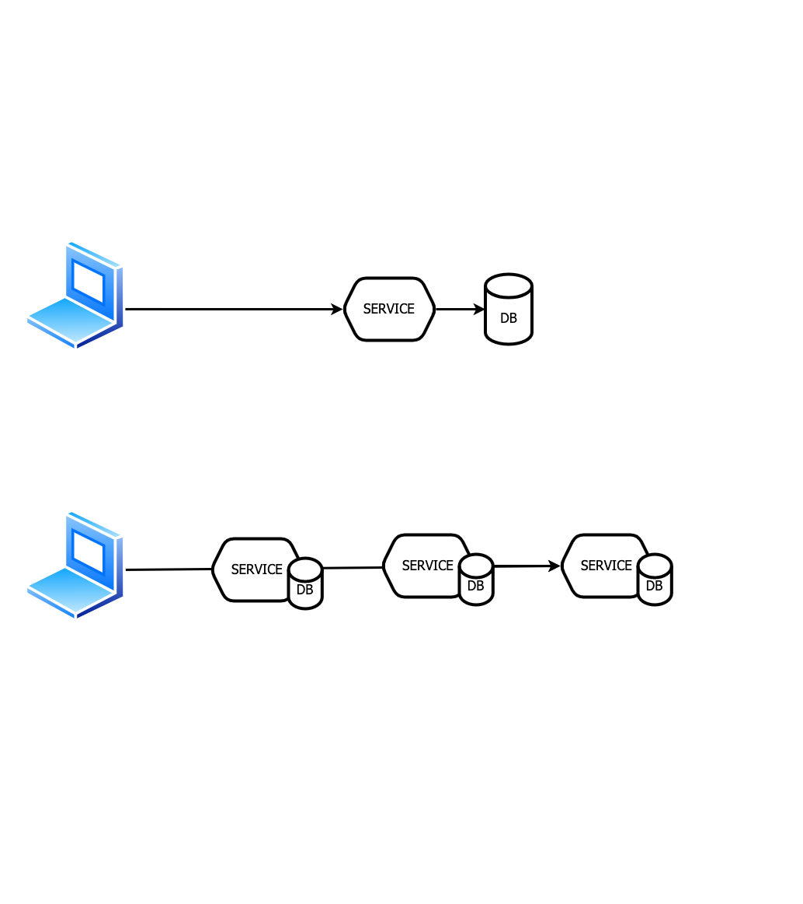
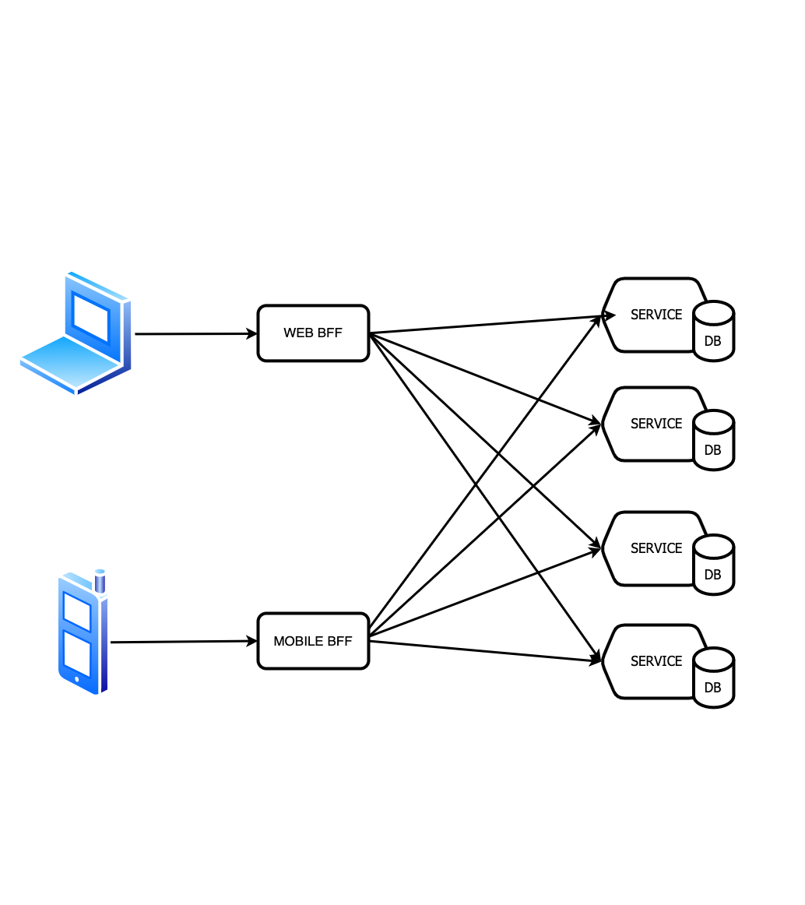

 

<!-- _class: centered -->
<!-- backgroundImage: url('./cover.png') -->

<!-- titulo y me presento y tutor-->
---

<!-- backgroundImage: url('./presentation_slide.png') -->

##### Miguel García Sanguino
15 años como developer
Frontend 70% Backend 30%
Software engineer en ING

<!-- 
Trabajo en ing, me han pagado el máster CLOUD APP
Esto es un trabajo de investigación, continuación del máster
 -->
---
<!-- backgroundImage: url('./intro_slide.png') -->
<!-- paginate: false -->
<!-- footer: Frontend vitaminized from the backend - Miguel García Sanguino -->

## Frontend vitaminized from the backend
 
<!-- _class: centered -->

Los procesos se han complicados
Las respuestas ya no son siempre únicas
Tenemos respuestas asincronas
Los datos se actualizan en tiempo

<!-- 

Porque el título?

Porque el título?

Antes una transacción era muy simple, con MS no tanto

Responder a front 1 vez? rapido pero solo parte o lenta pero completa?

Nos quedamos esperando hasta el infinito?

Que hacemos cuando se actualiza un dato?

-->

---
<!-- backgroundImage: url('./background.png') -->

### Patron Saga

Transaccion con microservicios
Asegura Consistencia
Rollback en caso de fallo
Orquestadas / Coreografiadas

 
<!--
Transaccion en MS se complican mucho

saga es un patron asegura consistencia

crea estructuras para caminos felices y marchas atras en caso de fallo

una muy usada, orquestacion y maquina de estados, pero acopla mucho

problemas en gobierno muchos equipos en empresas grandes

 --> 
---

### Patron Backend for Frontend

Uno por cada tipo de cliente
Adapta el api a cada consumidor
Simplifica clientes
Elimina la sobrecarga de servicios

 
<!--
La idea es 1 por cada tipo de cliente

saga es un patron asegura consistencia

crea estructuras para caminos felices y marchas atras en caso de fallo

una muy usada, orquestacion y maquina de estados, pero acopla mucho

problemas en gobierno muchos equipos en empresas grandes

 --> 
---

<!-- _class: split -->

### Objetivos:

Profundizar transacciones con microservicios coreografiados.

Investigar consumidores de procesos largos con respuesta múltiple.

#### Middleware
- servicios desacoplados
- saga coreografiada, sin estados
- enfocado a eventos
- escalables y resilientes

#### Frontend
- no impactar en middleware
- independiente y asíncrono
- consuma de los eventos
- notificaciones online / offline

<!-- MIDDLE  

 desacoplados -> entre ellos y tambien de los consumidores  

 Coreografia -> desconocer la transaccion, indepencida en desarrollo y ciclo de vida, codigo y equipos  

 Sin maquina de estados, por quitar la coreografia, simplificar  

 Eventos, porque da independencia, capacidad de cambiar el orden de la saga, meter mas pasos  

 Por experiencias paadas, una transaccion en MS se complican mucho 
 --> 

<!-- FRONT 

No queremos que el middleware se tenga que preocupar en informarnos ni que consumidores tiene, ni de que modelo de datos necesita cada uno

comunicacion independiente y asincrona 

propone un BFF consumira eventos, escucha sin molestar 

Por experiencias paadas, una transaccion en MS se complican mucho 

Y todas las buenas practicas que hemos aprendido en el master --> 

---

##### Caso de uso

Pedido de comida online

- Reserva de restaurante

- Asignar un rider

- Realizar pago

- Completar pedidos

<!-- 
Cada paso será un servicio 

Frontal
--> 

---
<!-- _class: centered -->

##### Caso de uso

<!-- los pasos happy path --> 

---

##### Caso de uso

Cada paso un servicio

Rollback en caso de fallo

Informar al usuario en cada paso

<!-- --> poner un grafico de saga a nivel funcional

<!-- completada vs cancelada --> 

---

## Stack middleware

- Kubernetes
- Kafka
- BBDD mongo
- Nodejs
- kafkajs
- express
- mongoose

---
### Flujo middleware

- único punto de entrada, independiente del consumidor
- servicios no tienen conexiones entre ellos
- Order genera el orderId y audita
- OrderId como correlation id
- Variables de entorno cambiar orden de la saga
- resiliencia y escalabilidad

<!-- cada servicio su bbdd

Orderid correlationId

** 
 -->

---

## Idempotencia

Marcamos el offset después de enviar la salida.
Deben ser idempotentes:

- todos los servicios de la saga
- los servicios externos
- los rollback de la saga

<!-- 
llevas 6 min!!!

hablar de base service -->

---
## Kafka Mongo connect

Pros
- envía eventos al persistir en bbdd
- simplifica idempotencia

Cons
- un servico más
- obliga a tener mongo en replica set de al menos 3 instancias

> Finalmente se descarta, no merece la pena

<!-- --> se planteo debezium, pero se uso connect
---

## Stack frontend

- BFF ~= middleware
- express: rest, WS, SSE, estáticos
- Rollup como builder
- Lit
- Kor-ui

---

### Frontend

- backend for frontend
- sin bbdd
- reenvía eventos de middle a front
- convierte eventos en notificaciones
- adapta modelos

---

## Estáticos y servicio juntos

El contendor front lleva dentro el servicio BFF y los estáticos
- Los desarrolla el equipo front a sus necesidades
- Agiliza el CI/CD y el testing
- Decide si envía online / offline

---

## Web Sockets vs Server Sent Events vs pooling

No se han encontrado grandes diferencias
- En los 3 casos se queda una conexión abierta, tiempos muy similares
- Pooling descartado por dejar 1 hilo y porque a los 30 seg se repite la petición
- Server Sent Events es REST
- Web Sockets permite bidireccionalidad y datos complejos

> para este caso de uso SSE

<!--   -->
---

## Arquitectura final en kubernetes

- ingress
- front
- servicios + bases de datos
- externals ~ Mocks
- notificaciones ~ Mocks
- Zookeeper y kafka

<!-- También están incluidos kowl y Kafka-ui -->
---

## E2E test

Test E2E en cypress con gherkin.

Cada test configura el api externals: tiempo y response code
(banco, restaurante, rider).

Tests con el usuario online y offline, check de notificaciones.

Tests comprueban el rollback en las bbdd.

> reportes: [sanguino.cloud.okteto.net](https://sanguino.cloud.okteto.net/)

--- 

<!-- _class: centered -->
## E2E test video
<video width="83%" controls autoplay>
    <source src="e2e.mp4" type="video/mp4">
</video>

---

## Conclusiones
Objetivos conseguidos:

- Saga coreografiada con eventos en kafka
- Servicios idempotentes, resilientes, escalables e independientes.
- El frontend consume actualizaciones sin afectar a los servicios

Destacable:

- A priori es bastante simple poca complejidad y muy mantenible
- BFF es fundamental para el proyecto
- SSE, WC, Pooling no hay mucha diferencia

<!-- habria que hacer test en el BFF de recursos consumidos -->
--- 

<!-- _class: split -->

## Trabajos futuros

<!-- 
Como resumen evolucionarlo y hacerlo un proyecto "real"

Performance tests de la conexión asíncrona

• En qué casos se bloquean hilos y en cuáles no.
• Cuál consume más recursos.
• Cuántas conexiones en paralelo puede soportar.

Escalabilidad BFF importante si un usiaro esta en una instancia y llega el evento a otra, que hacemos?
Hazelcast!!
 -->

Refactor
Performance conexión BFF
Escalabilidad
Testing
CI/CD

Observabilidad
Seguridad
Conciliaciones
Frontend – UX
Escalabilidad BFF

---

<!-- _class: centered -->

 

 
 
 
 
 

## GRACIAS!

