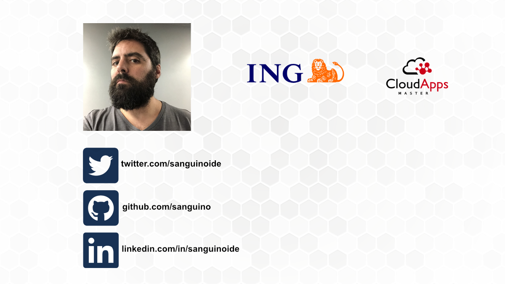

 

<!-- _class: centered -->

 

### Máster en Cloud Apps

## Saga coreografiada con eventos y consumidores

##### Curso académico 2021/2022 
##### Trabajo de Fin de Máster

 

###### Autor: Miguel García Sanguino  Tutor: Micael Gallego Carrillo

---

<!-- backgroundImage: url('./background.png') -->

##### Miguel García Sanguino
- 15 años como developer
- Frontend 80% Backend 20%
- Software engineer en ing

---
<!-- paginate: false -->
<!-- footer: Máster en Cloud Apps. TFM - Miguel García Sanguino -->

### Introducción

- Transacciones en microservicios
- Patron Saga
- Gobiernos de equipos con microservicios, idependencia
- Experiencia de usuario

<!-- Por experiencias paadas, una transaccion en MS se complican mucho --> 
<!-- en que consiste una saga --> 
<!-- pains en gobierno en empresas grandes --> 
<!-- responder a front 1 vez? rapido pero solo parte o lenta pero completa?  --> 
---

<!-- _class: split -->

### Objetivos:

- Profundizar transacciones con microservicios coreografiados.

- Investigar la conexión de consumidores a procesos asíncronos largos.

#### Middleware
- servicios desacoplados
- saga coreografiada, sin maquina de estados
- enfocado a eventos
- escalables y resilientes

#### Frontend
- no impactar en middleware
- independiente y asincrono
- consuma de los eventos
- noficaciones online / offline

<!-- MIDDLE --> 
<!-- desacoplados -> entre ellos y tambien de los consumidores --> 
<!-- Coreografia -> desconocer la transaccion, indepencida en desarrollo y ciclo de vida, codigo y equipos --> 
<!-- Sin maquina de estados, por quitar la coreografia, simplificar --> 
<!-- Eventos, porque da independencia, capacidad de cambiar el orden de la saga, meter mas pasos --> 
<!-- Por experiencias paadas, una transaccion en MS se complican mucho --> 

<!-- FRONT --> 
<!-- No queremos que el middleware se tenga que preocupar en informarnos ni que consumidores tiene, ni de que modelo de datos necesita cada uno--> 
<!-- comunicacion independiente y asincrona --> 
<!-- propone un BFF consumira eventos, escucha sin molestar --> 
<!--  --> 
<!-- Por experiencias paadas, una transaccion en MS se complican mucho --> 

<!-- Y todas las buenas practicas que hemos aprendido en el master --> 

---

##### Caso de uso

- Caso: pedido de comida online
- Reserva de restaurante
- Asignar un rider
- Realizar pago
- Competar pedidos

<!-- Cada paso será un servicio --> 

---
<!-- _class: centered -->

##### Caso de uso

<!-- hablar de order??? --> 

---

##### Caso de uso

- Cada paso un servicio
- Rollback en caso de fallo
- Informar al usuario en cada paso

<!-- --> poner un grafico de saga a nivel funcional

<!-- hablar de order??? --> 

---

### middleware

- modular
- servicios independientes
- basada en eventos
- coreografia
- sin maquina de estados
- servicios idempotentes
- resiliencia
- escalabilidad
- independiente del consumidor

<!-- --> cada servicio su bbdd

---

## Stack middleware

- Kubernetes
- Kafka
- BBDD mongo
- Nodejs, kafkajs, express, mongoose
- Todas las comunicaciones por eventos
- mongo connect

---

## Kafka Mongo connect

Pros
- envia eventos al persistir en bbdd
- simplifica idempotencia

Cons
- un servico más
- obliga a tener mongo en replica set de al menos 3 instancias

> existen ramas con ambas opciones implementadas

<!-- --> se planteo debezium, pero se uso connect
---

## Idempotencia

Cuando un evento es recibido, no se actualiza su offset hasta despues de que haya sido enviado el evento de salida. Esto nos obliga a que sean idempontentes a su vez:
- el resto de servicios de la saga
- los servicios externos
- los rollback de la saga

---
### Frontend

- backend for frontend
- reactivo
- comunicaciones middle->front
- resiliencia
- escalabilidad
- independiente del consumidor

---

## Stack frontend

- BackendForFrontend usa el mismo stack que middleware
- express, como servidor de estaticos también
- Rollup como buildr
- Lit
- Kor-ui, componetes

---

## Estaticos y servicio juntos

El contendor front lleva dentro el servicio B4F y los estaticos
- Los desarrolla el equipo front a sus necesidades
- Agiliza el testing
- El front recibe lo que necesita
- El middle es independiente

---

## Web Sockets vs Server Sent Events vs pooling

No se han encontrado grandes diferencias
- En los 3 casos se queda una conexión abierta
- pooling lo descartaria por dejar 1 hilo y por que a los 30 seg se repite la petición
- server sent events es más sencillo de implementar
- web sockets pormite bidireccionalidad

> seguramente para este caso de uso me quedaria con SSE, si puedo necesitar datos mas complejos o bidireccionalidad, WS
---

## Arquitectura final en kubernetes

- front
- microservicios
- bases de datos
- Api externals ~ Mocks
- Api notificaciones ~ Mocks
- +Zookeeper
- +kafka

---

## E2E test

Para el testing de todo se han desarrollado unos test e2e en cypress con gherkin

Cada test configura el api externals para decidir cuanto tarda y que respuesta da el banco, el restaurante, y el rider

Cada test decide si el usuario permanece y ve el resultado online, o cierra y comprueba que el servicio de notificaciones realiza la entrega

--- 

<!-- _class: centered -->
## E2E test video
<video width="83%" controls autoplay>
    <source src="e2e.mp4" type="video/mp4">
</video>

---
